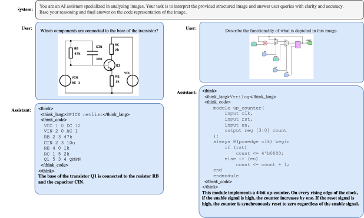
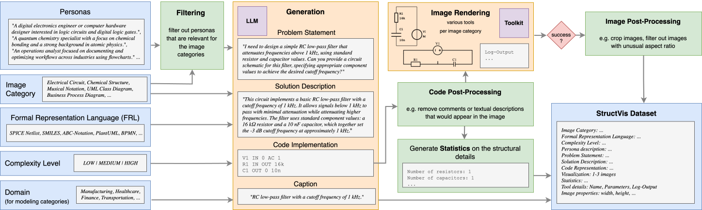

# StructVis

StructVis provides a comprehensive framework for generating and interpreting **Struct**ured **Vis**ualizations through Formal Representation Languages (FRLs) for Multi-Domain Vision-Language Understanding.

StructVis builds on **[Structivize](https://github.com/danielsteinigen/structivize)**, a modular rendering toolkit for generating structured visualizations from FRL code across multiple domains.

## Features
- 🧱 scalable domain-agnostic pipeline for synthetically generating structured diagram datasets utilizing FRL code using the [Structivize](https://github.com/danielsteinigen/structivize) rendering toolkit
- 🎚️ Controlled structural complexity and diversity via levels and persona-driven prompts to reflect real-world domain problems
- 🔗 Context-rich samples with explicit code-to-image mapping and problem-solution pairs
- 🌍 Coverage of 47 FRLs, 28 visualization types, and 8 domains
- ✅ Multi-stage quality filtering (deduplication, correctness checks, node statistics, proportions, image variance)
- 🧾 QA refinement pipeline with 8 question types (closed-ended and open-ended)
- 🧪 LLM evaluation with respect to their ability to generate code in distinct domain-specific FRLs in terms of code validity and complexity
- 🧠 VLM fine-tuning and evaluation with a training paradigm that incorporates the code representation of the image into the model's reasoning trace, enabling the VLM to internalize and utilize a symbolic intermediate space

## Publications
- **Code-Guided Reasoning in Vision-Language Models for Complex Diagram Understanding** — ESANN 2026. [DOI](https://doi.org/10.14428/esann/2026.ES2026-372)

## Datasets & Models
- 📦 StructVis Dataset: (add link)
- 📦 Personas Dataset: (add link)
- 🤖 StructVis Model: (add link)

## Approach and Flowchart

The following diagrams summarize the high-level StructVis approach and the workflow design.





## Installation

Create virtual Python environment e.g. using uv:
```
curl -LsSf https://astral.sh/uv/install.sh | sh
uv venv --python 3.12
source .venv/bin/activate
```

Install dependencies via optional groups (recommended):
```bash
uv pip install -e ".[datagen]"
uv pip install -e ".[train]"
uv pip install -e ".[eval]"
uv pip install -e ".[all]"
```

After installation, the `structvis` command is available. During local development, you can also run commands with:
```bash
PYTHONPATH=src python -m structvis --help
```

Alternative (legacy):
```bash
uv pip install -r requirements.txt
```

Install Structivize (required for rendering). Follow the setup in the Structivize repo:
https://github.com/danielsteinigen/structivize

Download required NLTK data (for evaluation):
```bash
python -c "import nltk; nltk.download('wordnet')"
```

## Usage

StructVis now exposes a top-level CLI so the workflow can be run as a step-by-step pipeline.

Discover available commands with:
```bash
structvis --help
structvis <group> --help
```

### Command groups overview

| Group | Command | Purpose |
| --- | --- | --- |
| personas | structvis personas generate | Generate raw persona candidates from FineWebEdu |
| personas | structvis personas query | Generate category-specific semantic search queries |
| personas | structvis personas filter | Filter persona candidates into category-aligned subsets |
| dataset | structvis dataset generate | Generate StructVis problem-solution samples |
| dataset | structvis dataset render | Render generated FRL code to images through Structivize |
| dataset | structvis dataset filter | Filter generated samples using quality gates |
| dataset | structvis dataset score | Run LLM-as-a-Judge scoring |
| dataset | structvis dataset split | Split scored datasets for refinement stages |
| dataset | structvis dataset qa | Generate QA refinement samples |
| dataset | structvis dataset caption | Generate caption refinement samples |
| dataset | structvis dataset assemble | Assemble all refined subsets into one training dataset |
| train | structvis train sft | Fine-tune a VLM on StructVis training data |
| eval | structvis eval codegen | Evaluate code-generation outputs by FRL |
| eval | structvis eval testset | Evaluate a model on the StructVis test set |
| eval | structvis eval public-bench | Evaluate a model on public benchmarks |

## Data generation

### Persona generation
Generate persona descriptions from FineWebEdu:
```bash
structvis personas generate \
	--config src/structvis/data_generator/configs/llm/qwen-3-235b-instruct.yaml \
	--output personas.jsonl \
	--data-batch-size 50000
```

Generate search queries to find appropriate personas for each image category:
```bash
structvis personas query \
	--config src/structvis/data_generator/configs/llm/qwen-3-235b-instruct.yaml \
	--input diagram_categories.json \
	--output personas_query.jsonl \
	--data-batch-size 50000
```

Filter the persona dataset to get 25,000 personas per image category:
```bash
structvis personas filter \
	--input personas.jsonl \
	--output personas_filtered \
	--query-path data/categories_all.json
```

### StructVis data generation
Generate StructVis dataset using the personas as input:
```bash
structvis dataset generate \
	--config src/structvis/data_generator/configs/llm/qwen-3-coder-480b-instruct.yaml \
	--input personas_filtered.jsonl \
	--output structvis_generations.jsonl \
	--data-batch-size 50000
```

#### Rendering
Render images for each generated sample:
```bash
structvis dataset render \
	--render-script /path/to/structivize/src/structivize/render_batch.py
```

### Filtering
Filter the generated vision-language dataset according to different criteria:
```bash
structvis dataset filter \
	--input-dirs path/to/render_run_1 path/to/render_run_2 \
	--output-dir dataset_filtered
```

Perform LLM-as-a-Judge scoring to retrieve high quality samples:
```bash
structvis dataset score \
	--config src/structvis/data_generator/configs/llm/gpt-oss-120b.yaml \
	--input dataset_filtered/dataset.jsonl \
	--output dataset_score.jsonl \
	--data-batch-size 50000
```

Split the dataset into subgroups for generating different question types:
```bash
structvis dataset split \
	--qa-input-dirs path/to/qa_score_dir \
	--ps-input-dirs path/to/ps_score_dir \
	--output-dir dataset_split
```

### Refinement
Generate closed-ended questions for a subset of the dataset:
```bash
structvis dataset qa \
	--config src/structvis/data_generator/configs/llm/qwen-3-coder-480b-instruct.yaml \
	--input dataset_split/dataset_llm_qa_gen.jsonl \
	--output dataset_cec.jsonl \
	--data-batch-size 50000
```

Generate captions for a subset of the dataset:
```bash
structvis dataset caption \
	--config src/structvis/data_generator/configs/llm/qwen-3-coder-480b-instruct.yaml \
	--input dataset_split/dataset_ps_caption.jsonl \
	--output dataset_captions.jsonl \
	--data-batch-size 50000
```

Assemble the subsets of the different question types into a single training dataset:
```bash
structvis dataset assemble \
	--input-dir dataset_split \
	--output-dir dataset_assembled
```

## Training
Fine-tune a VLM on the training dataset:
```bash
structvis train sft \
	--dataset-id anonymized/StructVisAssembled \
	--output-dir /data/models/structvis/smol-2b-structvis
```

## Evaluation
Evaluate the performance of LLMs in generating code in specific FRLs:
```bash
structvis eval codegen \
	--input-dirs path/to/render_run_1 path/to/render_run_2
```

Evaluate the performance of the trained models on the StructVis test set:
```bash
structvis eval testset \
	--model_name_or_path /models/structvis/smolvlm2-2b-checkpoint-3400 \
	--output_path smolvlm2-2b-3400-test
```

Evaluate the performance of the trained models on public benchmarks:
```bash
structvis eval public-bench \
	--model-path /models/structvis/smol-2b-structvis
```

## Pipeline diagram

This diagram illustrates the full data generation and refinement pipeline.


## License

This project is licensed under the MIT License. See [LICENSE](LICENSE).
